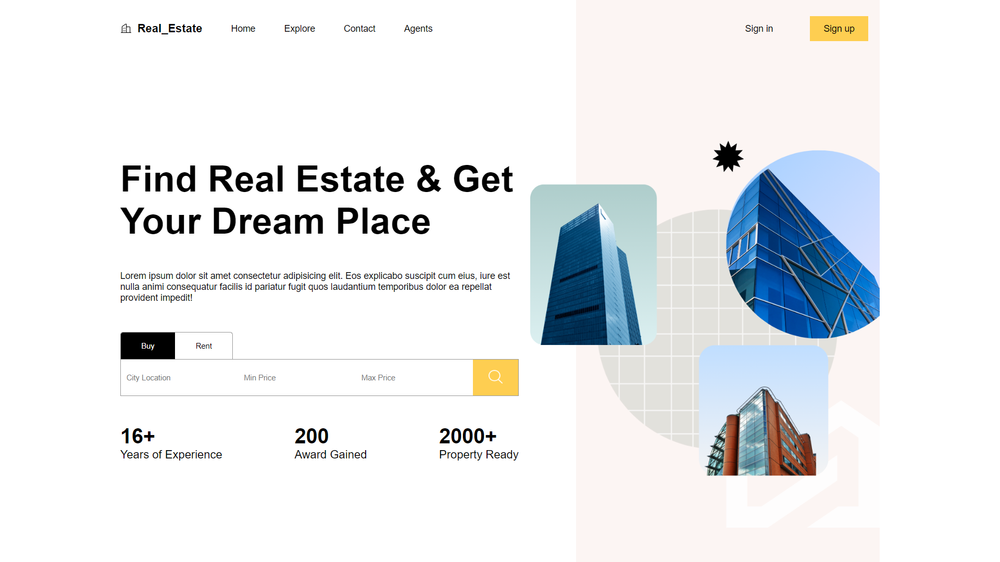
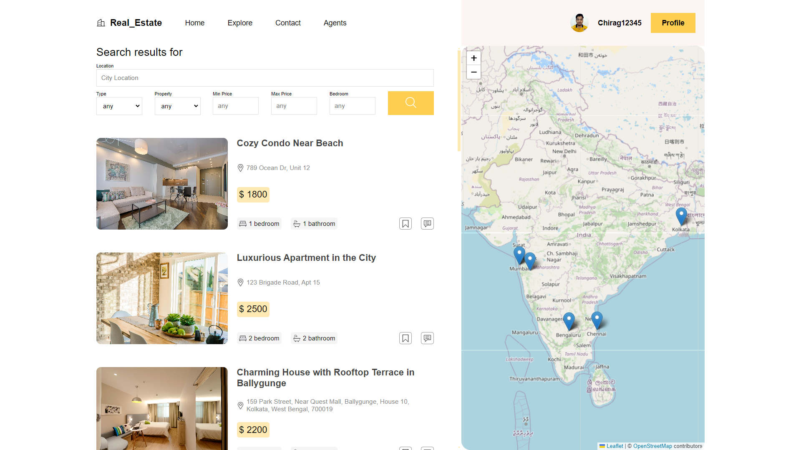
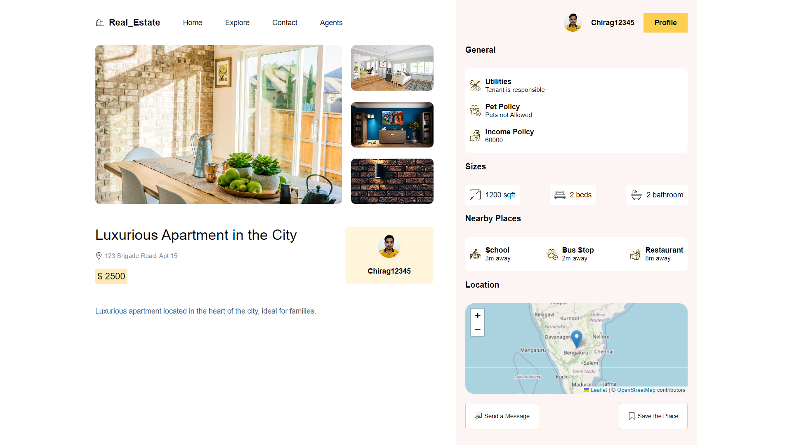
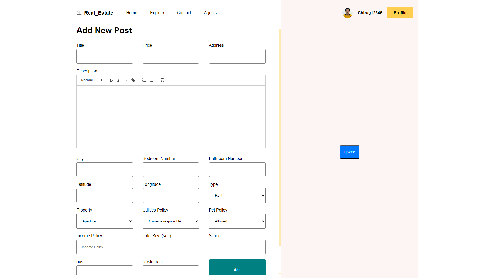
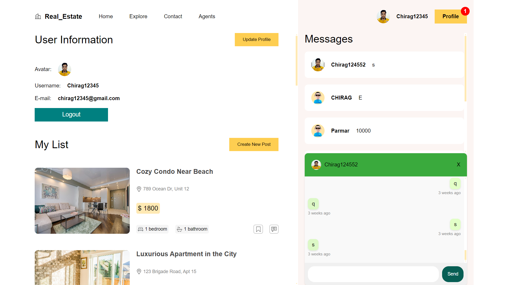

# Real Estate Management Platform



Welcome to our Real Estate Management Platform! This project offers a seamless experience for users looking to buy or rent properties. Dive into advanced browsing, filtering, and direct communication features that make property management easier than ever.

## Features

- **Advanced Browsing and Filtering:** Tailored search options based on user preferences for a personalized experience.
- **Real-Time Chat:** Integrated chat system for direct communication between users and property owners.
- **User-Friendly Interface:** A clean, intuitive design that enhances the buying and renting process.

## Technologies Used

- **Frontend:** React.js, SCSS, Zustand
- **Backend:** Express.js, Node.js, Prisma ORM, Socket.io
- **Database:** MongoDB

## ScreenShots

### Explore Page
Explore Page allows users to browse through all listed real estate properties. Here, users can view various properties available for sale or rent, filter them based on different criteria, and get a quick overview of each property.



### Single Page
Single Page offers a comprehensive view of a specific property listing. Users can see detailed information including multiple images showcasing the property, its location on a map, contact details of the owner, any restrictions or special conditions, and other relevant details. This page is crucial for users interested in learning more about a particular property before making inquiries or decisions.



### Add Post Page
Add Post Page enables users to create new property listings. Users can upload up to four images per listing and provide detailed information such as property type, location, price, and additional features. This page is essential for users looking to list their properties for potential buyers or renters.



### Profile Page
Profile Page provides a personalized view for users where they can manage their listings, saved posts, and messages received from other users. It allows users to respond to messages directly from this page, making it convenient for communication related to property inquiries and negotiations.




## Getting Started

Follow these instructions to set up the project locally.

### Prerequisites

- Node.js
- MongoDB

### Installation

1. Clone the repository:
   ```bash
   git clone https://github.com/yourusername/real-estate-management.git
   cd real-estate-management
   ```
2 configure the Backend
   ```bash
   cd api
   npm install
   node app.js
   ```
3 Set up the Frontend
```bash
cd client
npm install
npm run dev
```


## Contact

If you have any questions or feedback, feel free to reach out:

- **Email:** [chiragparmar4780@gmail.com](mailto:chiragparmar4780@gmail.com)
- **GitHub:** [chiragparmar2004](https://github.com/chiragparmar2004)
- **LinkedIn:** [Chirag Parmar](https://www.linkedin.com/in/chirag-parmar-203930223)


